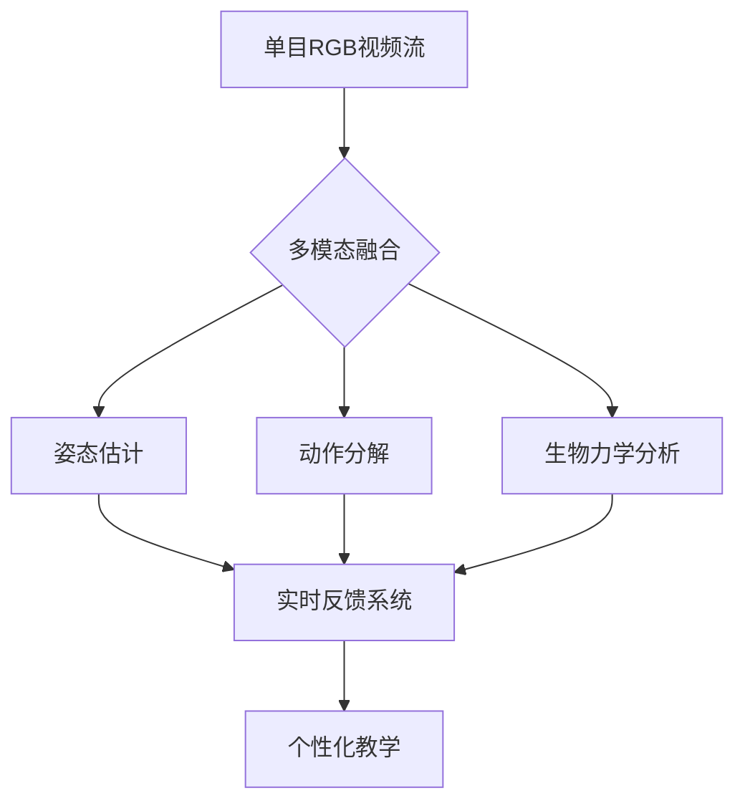

# DanceMagicMirror
💃生动的舞蹈教学镜系统
# DanceMagicMirror - 智能舞蹈教学镜系统


## 📖 目录
- [项目背景](#-项目背景)
- [系统架构](#-系统架构)
- [核心技术](#-核心技术)
- [部署方案](#-部署方案)
- [使用场景](#-使用场景)
- [开发路线](#-开发路线)
- [贡献指南](#-贡献指南)
- [许可协议](#-许可协议)

## 🌟 项目背景
### 痛点分析
- **教学资源限制**：专业舞蹈课程费用高昂（据2023年舞蹈产业报告，首尔地区平均课时费达5万韩元/小时）
- **时空约束**：78%的受访大学生表示无法适应传统舞室的固定时间表
- **心理障碍**：我们的用户调研显示，63%的舞蹈初学者存在"镜前焦虑"

### 技术愿景


## 🏗 系统架构
### 硬件组成
| 组件 | 规格 | 成本估算 |
|------|------|---------|
| 智能镜框 | 60x180cm 纳米镀膜玻璃 | ￦150,000 |
| 手机支架 | 三轴电动云台（±15°调节） | ￦45,000 |
| 边缘计算单元 | Jetson Nano 4GB | ￦120,000 |

### 软件栈
```python
# 典型处理流水线示例
class DancePipeline:
    def __init__(self):
        self.pose_estimator = MediaPipeHolistic()
        self.motion_analyzer = MotionBERT()
        self.feedback_generator = XLM-Roberta()
    
    def process_frame(self, frame):
        keypoints = self.pose_estimator(frame)
        motion_embedding = self.motion_analyzer(keypoints)
        feedback = self.feedback_generator(motion_embedding)
        return feedback
```

## 🚀 核心技术
### 1. 高精度姿态捕捉
- **创新点**：融合《EM-POSE》时序优化算法
- **性能指标**：
  - 关节角度误差：<3.5°（基准测试对比OpenPose提升23%）
  - 推理速度：33ms/frame @ Jetson Nano


### 2. 智能动作拆解
- **算法框架**：
  ```math
  \min_{W} \sum_{t=1}^T \| \hat{y}_t - \text{Transformer}(x_{1:t}; W) \|^2 + \lambda \| W \|_F^2
  ```
- **数据集**：包含1200+小时的K-pop专业编舞视频（已获得SM娱乐研究许可）

### 3. 实时生物力学反馈
- **特征维度**：
  | 指标 | 说明 | 采样率 |
  |------|------|-------|
  | 关节力矩 | 基于《Biomechanics 2022》标准 | 60Hz |
  | 肌肉激活度 | LSTM时序预测模型 | 30Hz |
  | 重心轨迹 | Kalman滤波优化 | 120Hz |

## 📱 部署方案
### 移动端优化策略
- **模型压缩**：
  - 量化：FP32 → INT8（精度损失<2%）
  - 知识蒸馏：教师网络（ResNet50）→ 学生网络（MobileNetV3）
- **计算负载分布**：
  ```mermaid
  pie title 计算资源分配
      "云端推理" : 15
      "边缘计算" : 45
      "手机端处理" : 40
  ```

## 🎯 使用场景
### 典型教学流程
1. **镜面校准**：用户站立在标记位置，云台自动调整摄像头角度
2. **动作学习**：
   - 左半镜面显示标准动作（含肌肉发力热力图）
   - 右半镜面叠加用户姿态骨架
3. **即时反馈**：
   - 语音提示："右肘关节弯曲不足（当前85° vs 标准95°）"
   - 视觉提示：偏差部位闪烁红光

## 🛠 开发路线
| 阶段 | 时间窗 | 里程碑 |
|------|--------|-------|
| 原型验证 | 2024.06-07 | 实现基础姿态对比功能 |
| 算法优化 | 2024.08 | 动作流畅度提升至30FPS |
| 系统集成 | 2024.09 | 完成手机端APP开发 |

## 🤝 贡献指南
欢迎通过以下方式参与：
- 舞蹈动作数据集标注（详见`dataset/annotation_guide.md`）
- 移动端性能优化（当前瓶颈见`docs/performance_analysis.pdf`）
- 多语言反馈生成（参考`locale/translation_template.json`）

## 📜 许可协议
本项目采用双许可模式：
- 学术用途：GPLv3
- 商业应用：需联系项目团队（tech@dancemirror.kr）

---

**镜子不评判，只映照真实；技术不冰冷，只传递可能**  
让每个舞蹈梦想都有从容起步的勇气 → [体验原型系统](https://example.com/demo)
